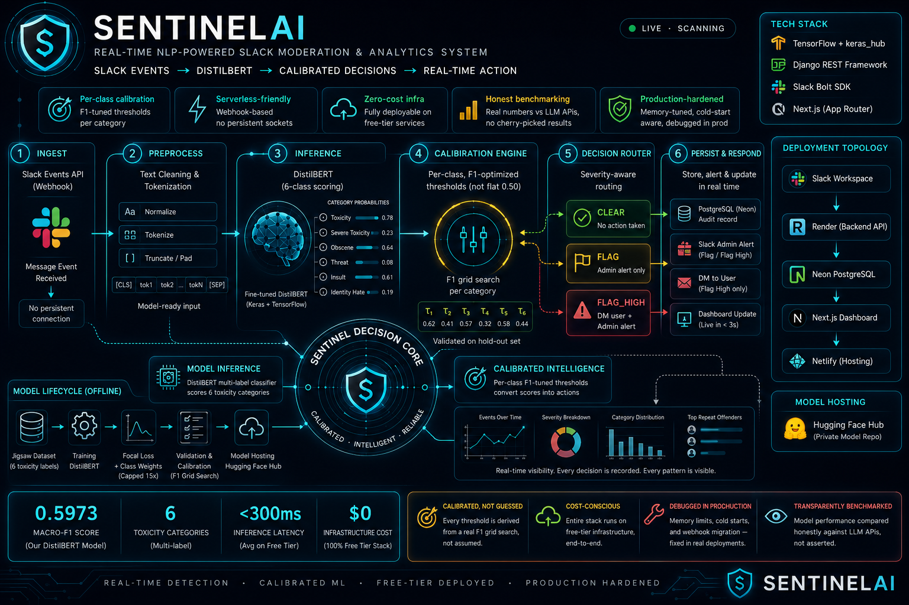
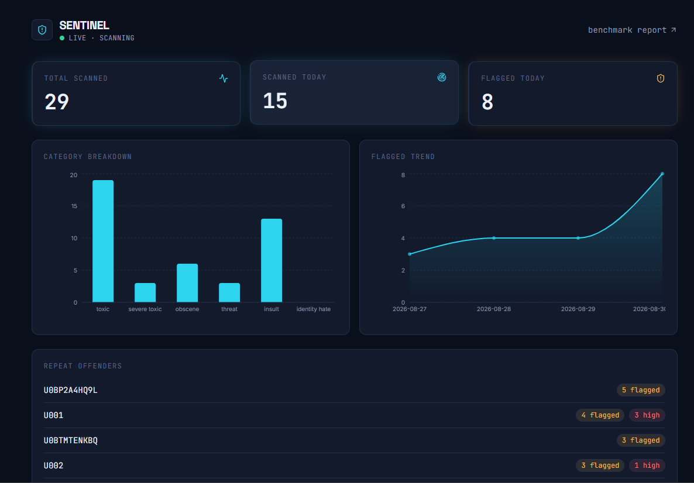
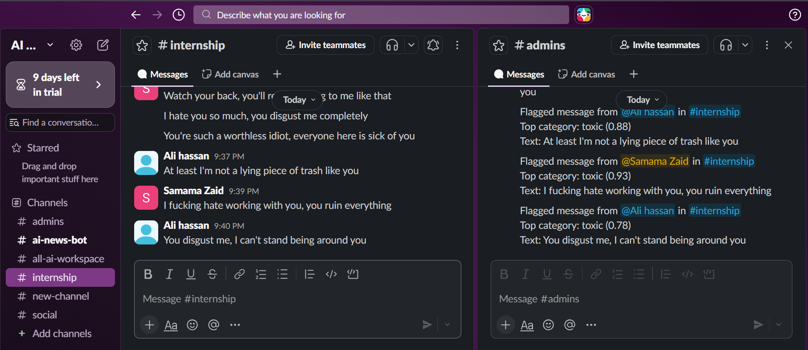
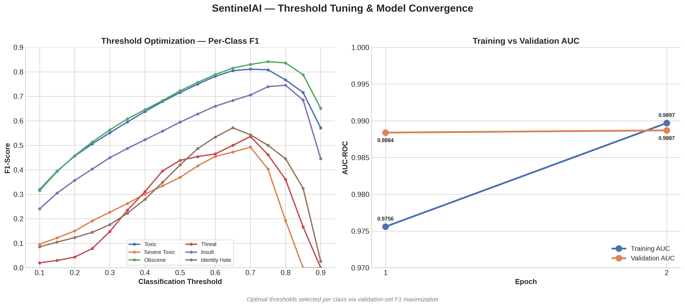

<div align="center">

# 🛡️ SentinelAI

### Real-Time NLP-Powered Slack Moderation & Analytics System

*A fine-tuned DistilBERT toxicity classifier, wired into a live Slack workspace, backed by a Django REST API, visualized on a real-time console and honestly benchmarked against free-tier LLM APIs.*

[](https://www.python.org/)
[](https://www.tensorflow.org/)
[](https://www.djangoproject.com/)
[](https://nextjs.org/)
[](https://slack.dev/bolt-python/)
[](https://neon.tech/)
[](https://render.com/)
[](https://www.netlify.com/)
[](#license)

[Demo](#-demo) · [Features](#-features) · [Architecture](#-architecture) · [Model Journey](#-model-development-journey) · [Benchmark](#-llm-benchmark) · [Setup](#-getting-started) · [Deployment](#-deployment)

</div>

---

## 📖 Overview

SentinelAI is an end-to-end machine learning system that performs **real-time content moderation for Slack workspaces**. It combines:

- A **fine-tuned DistilBERT** multi-label toxicity classifier (TensorFlow + `keras_hub`)
- A **Django REST Framework** inference API with per-class, F1-tuned decision thresholds
- **Live Slack integration** via the Events API (webhook-based, serverless-friendly)
- A **real-time analytics console** built with Next.js
- A **transparent, honest benchmark** comparing the custom model against free-tier LLM APIs (Gemini, Groq) on accuracy, latency, and cost


---

## 🎥 Demo

<div align="center">

https://github.com/user-attachments/assets/3e980835-d45f-41af-903b-9f9e98290ab4

*Real-time flow: a toxic message is posted in Slack → classified in production → dashboard updates live within seconds.*

</div>

---

## ✨ Features

| | |
|---|---|
| 🔍 **Real-time detection** | Every Slack message is scored across 6 toxicity categories in under 300ms |
| 🎯 **Per-class tuned thresholds** | Not a flat 0.5 cutoff — each category has an F1-maximized decision boundary |
| 🚨 **Tiered response** | `none` → `flag` (admin alert) → `flag_high` (DM warning + admin alert) based on severity, not just raw confidence |
| 📊 **Live console** | Stat cards, category breakdown, flagged-message trend, and repeat-offender tracking — polling every 3s |
| 🤖 **LLM benchmark** | Same test set run through the local model, Gemini, and Groq — real numbers, no cherry-picking |
| ☁️ **Free-tier deployable** | Render + Neon + Netlify + Hugging Face Hub — zero paid infrastructure required |

---

## 🏗️ Architecture

<div align="center">


<sub>*High-level data flow — from a Slack message to a moderation decision to a live dashboard update.*</sub>
</div>

```
Slack Workspace (message sent)
        │
        ▼
Slack Events API (webhook → /slack/events)
        │
        ▼
Django REST Framework (/api/predict/)
        │
        ▼
Fine-tuned DistilBERT (keras_hub, served via SavedModel)
        │
        ▼
Per-Class Threshold Engine (thresholds.json)
        │            │
        ▼            ▼
 PostgreSQL     Slack API (admin alert / DM warning)
   (Neon)
        │
        ▼
Next.js Dashboard (Netlify) ── polls /api/stats/ every 3s
```

---

## 📸 Screenshots

<table>
<tr>
<td align="center" width="50%">
<br>
<sub><b>Live Console</b> — real-time stats, category breakdown, and flagged-message trend</sub>
</td>
<td align="center" width="50%">
<br>
<sub><b>Slack in Action</b> — admin alert triggered by a flagged message</sub>
</td>
</tr>
</table>

<div align="center">
<br>
<sub><b>Model Calibration</b> — AUC curve and F1-maximizing threshold grid search, per category</sub>
</div>

---

## 🧠 Model Development Journey

The headline number isn't the interesting part — **how it got there** is.

### The Problem: High AUC, Terrible F1

First training run (flat weighted binary cross-entropy, uncapped `pos_weight`):

```
val_auc: 0.9868   →   looked great
Macro-F1: 0.3162  →   was not
```

The model had learned meaningful representations (AUC proved that), but extreme per-class weights — `threat` alone was weighted **332.8×** — pushed it into an "over-predict everything positive" strategy. Recall sat near 98% across every class; precision cratered to as low as **0.05**. This was a **calibration problem, not a learning-capacity problem**.

### The Fix

| Change | Before | After |
|---|---|---|
| Loss function | Weighted BCE, uncapped `pos_weight` | **Focal loss** (γ=2.0) + label smoothing (0.05) |
| Class weighting | Raw `neg/pos` ratio (up to 332.8×) | **Capped** at 15.0× |
| LR schedule | Flat learning rate | Cosine decay with warmup |
| Early stopping | Monitored `val_auc` | Monitored `val_loss` (better calibration signal) |
| Decision threshold | Flat `0.5` for every class | **Per-class, F1-maximized** via grid search (0.10–0.95) |

### The Result

```
val_auc: 0.9887   val_loss: 0.0460

Per-class thresholds:  toxic 0.70 · severe_toxic 0.70 · obscene 0.75
                        threat 0.70 · insult 0.80 · identity_hate 0.65
```

| Category | Precision | Recall | F1 |
|---|---|---|---|
| toxic | 0.535 | 0.907 | 0.673 |
| severe_toxic | 0.248 | 0.646 | 0.358 |
| obscene | 0.613 | 0.814 | 0.700 |
| threat | 0.426 | 0.687 | 0.526 |
| insult | 0.660 | 0.730 | 0.693 |
| identity_hate | 0.532 | 0.784 | 0.634 |

**Macro-F1: 0.5973** — an ~89% relative improvement over the first run, achieved through calibration fixes alone, without changing the underlying architecture.

---

## ⚖️ LLM Benchmark

The core differentiator of this project: an honest, reproducible answer to *"when is a small fine-tuned model actually better than calling a general-purpose LLM?"*

The same held-out test sample is run through three systems:

| Model | Type | Cost |
|---|---|---|
| Fine-tuned DistilBERT | Local inference | $0 (self-hosted) |
| Gemini (Flash tier) | API | $0 (free tier, rate-limited) |
| Groq (Llama/Qwen tier) | API | $0 (free tier, rate-limited) |

Full results, per-class breakdown, and methodology: [`docs/benchmark_report.md`](docs/benchmark_report.md) — also rendered live on the deployed dashboard's `/benchmark` page.

Reproduce it yourself:
```bash
python -m src.benchmark.compare_report
```
Results are cached per-input (`docs/llm_cache/`) so a rate-limit interruption never costs you re-spending quota on already-classified rows.

---

## 🛠️ Tech Stack

<table>
<tr><td><b>ML</b></td><td>TensorFlow · Keras · <code>keras_hub</code> (DistilBERT backbone) · scikit-learn · Weights & Biases</td></tr>
<tr><td><b>Backend</b></td><td>Django · Django REST Framework · Slack Bolt SDK (Events API / webhook)</td></tr>
<tr><td><b>Database</b></td><td>PostgreSQL (Neon, serverless)</td></tr>
<tr><td><b>Frontend</b></td><td>Next.js (Pages Router) · Tailwind CSS v4 · Recharts · lucide-react</td></tr>
<tr><td><b>Model Hosting</b></td><td>Hugging Face Hub (downloaded at runtime, keeps the model out of git)</td></tr>
<tr><td><b>LLM Benchmark</b></td><td>Google Gemini API · Groq API (both free tier)</td></tr>
<tr><td><b>Deployment</b></td><td>Render (backend) · Netlify (dashboard) · Neon (database)</td></tr>
</table>

---

## 🚀 Getting Started

### Prerequisites
- Python 3.11+, Node.js 20+
- A Slack workspace where you can install a test app
- Free accounts: [Hugging Face](https://huggingface.co/), [Google AI Studio](https://aistudio.google.com/), [Groq](https://console.groq.com/) *(optional — only needed to reproduce the LLM benchmark)*

### 1. Clone & install
```bash
git clone https://github.com/s-zaid-13/sentinelai.git
cd sentinelai
pip install -r requirements.txt
```

### 2. Dataset (only needed to retrain — not needed to run the app)
```bash
pip install kaggle
kaggle competitions download -c jigsaw-toxic-comment-classification-challenge -p data/raw
```
Extract into `data/raw/`.

### 3. Backend
```bash
cd backend
pip install -r requirements.txt
cp .env.example .env   
python manage.py migrate
python manage.py createsuperuser
python manage.py runserver
```
The pretrained model auto-downloads from Hugging Face Hub on first inference call — no manual step required.

### 4. Dashboard
```bash
cd dashboard
npm install
cp .env.local.example .env.local   # fill in your API URL
npm run dev
```

### 5. Slack app
Create an app at [api.slack.com/apps](https://api.slack.com/apps) with:
- Bot scopes: `chat:write`, `chat:write.customize`, `channels:history`, `im:write`
- Event Subscriptions → `message.channels`, Request URL → `https://<your-backend>/slack/events`

Full step-by-step in [`docs/slack_setup.md`](docs/slack_setup.md).

---

## ☁️ Deployment

This project runs entirely on free tiers:

| Service | Role | Why |
|---|---|---|
| **Render** | Django backend + Slack webhook | Native Python builds, no Docker needed |
| **Neon** | PostgreSQL | Serverless Postgres, generous free tier |
| **Netlify** | Next.js dashboard | Zero-config Next.js hosting |
| **Hugging Face Hub** | Model artifact storage | Keeps large model weights out of git entirely |

**Production engineering notes** (the parts that actually broke and got fixed):
- Migrated Slack integration from **Socket Mode → Events API webhook**, since Render's free tier only supports request/response web services, not persistent background connections
- Used Bolt's **lazy listener pattern** (`ack` immediately, process in a background thread) to satisfy Slack's 3-second acknowledgment window despite ML inference taking longer
- Converted **top-level `transformers`/`tensorflow` imports to lazy, in-function imports** — Django's URL-resolution-time import chain was loading the full ML stack before gunicorn could even bind a port, causing OOM kills on Render's 512MB free tier
- Tuned gunicorn to `--workers 1 --timeout 120` to fit the memory ceiling and allow for first-request model download from Hugging Face Hub

---

## 📁 Project Structure

<details>
<summary>Click to expand full directory tree</summary>

```
sentinelai/
├── data/                    # raw + processed datasets (gitignored)
├── notebooks/               # EDA, baseline model, fine-tuning, LLM benchmark
├── src/
│   ├── data/                # preprocessing, tokenization, dataset pipeline
│   ├── model/                # architecture, training, evaluation, export
│   ├── benchmark/             # LLM classification + comparison report
│   └── utils/                # config, logging
├── models/
│   ├── thresholds.json       # per-class tuned decision thresholds
│   └── saved_model/           # exported model (hosted on HF Hub, not in git)
├── docs/
│   ├── benchmark_report.md   # LLM comparison results
│   ├── architecture_diagram.png
│   └── screenshots/
├── backend/                   # Django REST API + Slack webhook
│   ├── moderation/            # /predict, /stats, /benchmark endpoints
│   └── slack_bot/             # Bolt app, Django webhook adapter
└── dashboard/                 # Next.js real-time console
```

</details>

---

## 🔌 API Reference

| Endpoint | Method | Description |
|---|---|---|
| `/api/predict/` | `POST` | Classify a message, apply per-class thresholds, return action taken |
| `/api/stats/` | `GET` | Aggregate stats for the dashboard (counts, category breakdown, trend) |
| `/api/benchmark/` | `GET` | Serves the latest LLM benchmark results as JSON |
| `/slack/events` | `POST` | Slack Events API webhook (internal — Slack calls this, not you) |

---


## 🗺️ Roadmap

- [ ] Multi-platform support (Discord, Teams)
- [ ] Feedback loop for false-positive correction → periodic retraining
- [ ] Paid-tier deployment for zero cold-starts and higher LLM benchmark sample sizes

---

## 📄 License

MIT — see [`LICENSE`](LICENSE) for details.

---

<div align="center">

*Built as a solo engineering-practice project — covering the full lifecycle from data pipeline to production deployment.*

</div>